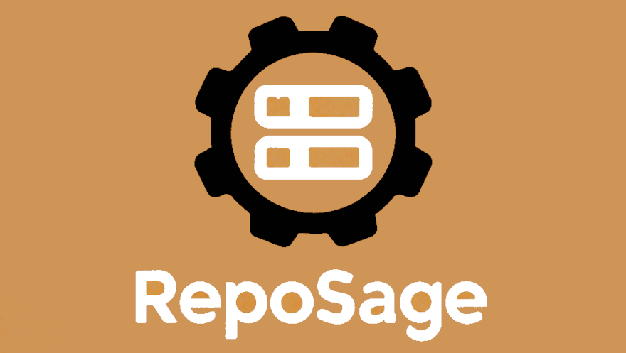

# RepoSage



[](https://github.com/hgosansn/reposage/actions/workflows/repo-sage.yml)

RepoSage leverages AI and Retrieval-Augmented Generation (RAG) to implement features/fix bugs and makes changes on a repository.


## Features

- Analyzes the repository state
- Finds potential improvements
- Implements the improvements in the form of changesets
- Can commit changes directly to the main branch or create pull requests
- Each commit/PR contains a detailed message explaining the changes
- Maintains a changelog to track all improvements and provide context for future enhancements
- Generates tests for each suggested change to ensure quality

## Setup

1. Clone the repository.
2. Install dependencies using `pip install -r repo-sage-action/requirements.txt`.
3. Configure the bot using the `repo-sage-action/config.yaml` file.
4. Run the bot using `python repo-sage-action/bot.py`.

## Running the Bot

### Local Execution

For direct commits to the main branch (default):

```sh
python repo-sage-action/bot.py \
  --github-token <GITHUB_TOKEN> \
  --repo <OWNER/REPO> \
  --open-router-api-key <API_KEY> \
  --model qwen/qwq-32b:free
```

For creating pull requests instead of direct commits:

```sh
python repo-sage-action/bot.py \
  --github-token <GITHUB_TOKEN> \
  --repo <OWNER/REPO> \
  --open-router-api-key <API_KEY> \
  --model qwen/qwq-32b:free \
  --use-pr
```

You can also provide additional parameters:

```sh
python repo-sage-action/bot.py \
  --github-token YOUR_TOKEN \
  --repo owner/repo \
  --open-router-api-key YOUR_API_KEY \
  --model "qwen/qwq-32b:free" \
  --base-branch "main" \
  --description "Focus on improving error handling and documentation"
```

### Manual GitHub Action Trigger

You can manually trigger the RepoSage action from your GitHub repository:

1. Go to your repository on GitHub
2. Click on the "Actions" tab
3. Select the "RepoSage" workflow from the sidebar
4. Click the "Run workflow" dropdown button
5. (Optional) Configure the following parameters:
   - **Model**: AI model to use for analysis (default: qwen/qwq-32b:free)
   - **Base branch**: Branch to use for analysis (default: main)
   - **Description**: What you want RepoSage to focus on (e.g., "Improve error handling", "Optimize performance", "Enhance documentation")
   - **Use PR**: Create pull requests instead of committing directly (default: false)
6. Click "Run workflow"

## Changelog

RepoSage maintains a `CHANGELOG.md` file in your repository that tracks all changes it makes. This changelog serves two purposes:

1. **History Tracking**: It documents all improvements made to your codebase over time
2. **Context for Future Changes**: Each time RepoSage runs, it reads the changelog to understand previous improvements, ensuring new changes build upon and don't conflict with previous work

The changelog follows the [Keep a Changelog](https://keepachangelog.com/) format, categorizing changes as:
- **Added**: New features or functionality
- **Changed**: Updates to existing features
- **Fixed**: Bug fixes and error corrections

## Testing the Bot

To test the bot's functionality, follow these steps:

**Run the Bot**: Navigate to the repository's root directory and run the bot.

```sh
python repo-sage-action/bot.py \
  --github-token <GITHUB_TOKEN> \
  --repo <OWNER/REPO> \
  --open-router-api-key <API_KEY> \
  --model qwen/qwq-32b:free
```

